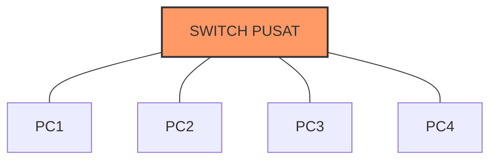

Sebelum terjun ke konfigurasi router yang rumit, kita harus paham dulu "bahasa" yang digunakan oleh komputer untuk saling berkomunikasi.

## 🧅 OSI Layer (The Holy Grail)

Model OSI (*Open Systems Interconnection*) adalah standar komunikasi data yang terdiri dari 7 lapisan.

:::tip[Filosofi Troubleshooting]
Seorang Network Engineer yang jago selalu melakukan *troubleshooting* dari **Layer 1 (Bawah)** ke atas.
*"Internet mati? Cek dulu kabelnya nyolok apa nggak (Layer 1), baru cek IP Address-nya (Layer 3)."*
:::

| No | Layer | Fungsi Utama | Perangkat/Protokol |
| :--- | :--- | :--- | :--- |
| 7 | **Application** | Antarmuka aplikasi dengan jaringan. | HTTP, FTP, SMTP, Browser |
| 6 | **Presentation** | Enkripsi, kompresi, dan format data. | SSL/TLS, JPEG, MP3 |
| 5 | **Session** | Mengelola sesi koneksi antar host. | NetBIOS, RPC |
| 4 | **Transport** | Pengiriman data. | **TCP** (Reliable), **UDP** (Cepat), Port |
| 3 | **Network** | Routing & pengalamatan logis (IP). | **Router**, IP Address, ICMP |
| 2 | **Data Link** | Pengalamatan fisik (MAC) & error checking. | **Switch**, MAC Address, Ethernet |
| 1 | **Physical** | Transmisi bit data (0 & 1) via media fisik. | **Kabel UTP**, Hub, Sinyal Wifi |

:::note[Hapalan Cepat]
**A**nak **P**ak **S**oleh **T**idak **N**akal **D**alam **P**elajaran.
(Application, Presentation, Session, Transport, Network, Data Link, Physical)
:::

## 📬 IP Address (IPv4)

IP Address adalah alamat identitas komputer di jaringan. Contoh: `192.168.1.1`

### Kelas IP Address
Meskipun dunia industri sudah beralih ke CIDR (*Classless*), konsep kelas ini masih sering muncul di ujian sekolah.

* **Kelas A**: `1.0.0.0` - `126.x.x.x` (Untuk skala Enterprise besar)
* **Kelas B**: `128.0.0.0` - `191.x.x.x` (Skala Menengah)
* **Kelas C**: `192.0.0.0` - `223.x.x.x` (Skala Kecil / LAN Rumahan)

### IP Private vs IP Public
* **IP Public**: Bisa diakses dari internet global. (Berbayar/Sewa dari ISP).
* **IP Private**: Hanya berlaku di jaringan lokal (LAN). Gratis & bebas pakai.
    * `10.0.0.0/8` (Biasanya jaringan kantor besar)
    * `172.16.0.0/12`
    * `192.168.0.0/16` (Wajib hafal! Paling sering dipakai di Lab)

## 🕸️ Topologi Jaringan

Cara menghubungkan komputer secara fisik.

### 1. Topologi Star (Bintang) ⭐
Semua komputer terhubung ke satu perangkat pusat (Switch).
* **Kelebihan:** Jika satu kabel putus, komputer lain aman.
* **Kekurangan:** Boros kabel, bergantung pada Switch.

