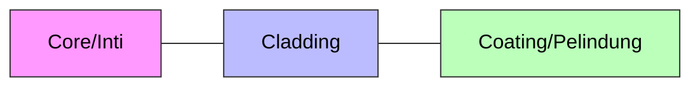

import ColorSwatch from '../../../components/ColorSwatch.astro';

Selamat datang di **Layer 1 (Physical)**. Di sini tempatnya kuli kabel beraksi. Camkan ini baik-baik:
> *"Kalau kabel jelek atau crimpingan ampas, config router se-dewa apapun percuma. Latency tinggi, packet loss, dimarahin klien."*

## 🧵 Kabel UTP (Tembaga)

Kabel LAN standar sejuta umat. Di dalamnya ada 8 kabel kecil (4 pasang) yang dipilin.

### Straight vs Cross
*   **Straight:** Ujung A dan B sama-sama pakai standar **T568B**.
*   **Cross:** Ujung A pakai **T568A**, Ujung B pakai **T568B**. (Digunakan untuk menghubungkan device sejenis, meski sekarang jarang karena ada Auto-MDIX).

### 🎨 Kode Warna (Hukum Wajib Hafal)

Di Indonesia, kita hampir selalu pakai standar **T568B** (Straight). Tapi kalau mau bikin kabel Cross, kamu wajib tau **T568A** juga.

#### 1. Standar T568B (Paling Umum / Straight)

| Pin | Warna | Visual |
| :--- | :--- | :--- |
| 1 | **Putih Orange** | <ColorSwatch color="orange-500" gradient /> |
| 2 | **Orange** | <ColorSwatch color="orange-500" /> |
| 3 | **Putih Hijau** | <ColorSwatch color="green-600" gradient /> |
| 4 | **Biru** | <ColorSwatch color="blue-600" /> |
| 5 | **Putih Biru** | <ColorSwatch color="blue-600" gradient /> |
| 6 | **Hijau** | <ColorSwatch color="green-600" /> |
| 7 | **Putih Coklat** | <ColorSwatch color="amber-700" gradient /> |
| 8 | **Coklat** | <ColorSwatch color="amber-700" /> |

#### 2. Standar T568A (Untuk Ujung Kabel Cross)

*Perhatikan: Hijau dan Orange bertukar posisi.*

| Pin | Warna | Visual |
| :--- | :--- | :--- |
| 1 | **Putih Hijau** | <ColorSwatch color="green-600" gradient /> |
| 2 | **Hijau** | <ColorSwatch color="green-600" /> |
| 3 | **Putih Orange** | <ColorSwatch color="orange-500" gradient /> |
| 4 | **Biru** | <ColorSwatch color="blue-600" /> |
| 5 | **Putih Biru** | <ColorSwatch color="blue-600" gradient /> |
| 6 | **Orange** | <ColorSwatch color="orange-500" /> |
| 7 | **Putih Coklat** | <ColorSwatch color="amber-700" gradient /> |
| 8 | **Coklat** | <ColorSwatch color="amber-700" /> |

:::tip[Tips Crimping Anti Gagal]
Saat memasukkan kabel ke konektor RJ-45, pastikan **kulit kabel luar (jacket)** ikut masuk dan terjepit di dalam konektor.
*   **Kalau terjepit:** Kabel awet, ditarik gak copot.
*   **Kalau nggak:** Kabel gampang goyang, koneksi putus-nyambung (intermittent).
:::

---

## 💎 Fiber Optic (Kaca)

Sultan-nya media transmisi. Menggunakan cahaya untuk kirim data.
*   **Kecepatan:** Speed of light (cahaya).
*   **Jarak:** Bisa puluhan KM tanpa sinyal turun.
*   **Kelebihan:** Anti petir, anti gangguan sinyal radio (interferensi).

:::danger[BAHAYA POTONGAN KACA!]
Potongan core Fiber Optic itu **kaca tajam tak kasat mata**.
*   **JANGAN DITIUP**, nanti masuk mata/terhirup.
*   **JANGAN DIBUANG SEMBARANGAN**.
*   Kalau masuk ke kulit, sakitnya minta ampun dan susah diambil karena bening.
*   Kalau masuk pembuluh darah (mengalir ke jantung), bisa **FATAL/MATI**.
*   *Tips:* Selalu siapkan lakban hitam untuk memungut/menempelkan sisa potongan kaca.
:::

### Jenis Kabel FO (Wajib Tau Biar Gak Salah Beli)

| Jenis | Warna Kabel | Inti (Core) | Jarak Tempuh | Sinar |
| :--- | :--- | :--- | :--- | :--- |
| **Single Mode** | 🟡 **Kuning** | Kecil banget (9 mikron) | Jauh banget (Antar Kota/Gedung) | Laser |
| **Multi Mode** | 🟠 **Orange** / 💠 **Tosca** | Agak besar (50-62.5 mikron) | Pendek (Dalam Gedung Server) | LED |

### 🔌 Tipe Konektor (Jangan Salah Colok!)

Kepala kabel FO ada warnanya. Jangan asal colok karena sudut potongannya beda!

*   **UPC (Biru) 🔵**: Potongan lurus/datar. Paling umum dipakai.
*   **APC (Hijau) 🟢**: Potongan miring (8 derajat). Biasanya untuk TV Kabel/GPON.

:::caution[Awas Pecah!]
**JANGAN** colok konektor **Biru (UPC)** ke lubang **Hijau (APC)** atau sebaliknya. Ujung kacanya akan beradu dan pecah/retak. Redaman langsung jeblok!
:::

### Anatomi Kabel FO

Bagian dalam sehelai kabel optik (Core) itu setipis rambut manusia.

1.  **Core:** Kaca tipis tempat cahaya lewat.
2.  **Cladding:** Pemantul cahaya agar tetap di dalam core (prinsip *Total Internal Reflection*).
3.  **Coating:** Plastik pelindung kaca biar gak gampang patah.

### 🌈 Kode Warna 12 Core (The Legend)

Di lapangan, satu kabel FO besar (tube) isinya bisa banyak core. Biar gak bingung, ada urutan warnanya.

**Mnemonic:** *"BOHCAP MeHiKuUPiTo"* (Hapalkan mantra ini!)

| No | Warna | Mnemonic | Visual |
| :-- | :-- | :-- | :-- |
| 1 | **Biru** | **B** | <ColorSwatch color="blue-600" type="circle" /> |
| 2 | **Orange** | **O** | <ColorSwatch color="orange-500" type="circle" /> |
| 3 | **Hijau** | **H** | <ColorSwatch color="green-600" type="circle" /> |
| 4 | **Coklat** | **C** | <ColorSwatch color="amber-800" type="circle" /> |
| 5 | **Abu-abu** | **A** | <ColorSwatch color="gray-500" type="circle" /> |
| 6 | **Putih** | **P** | <ColorSwatch color="white" type="circle" /> |
| 7 | **Merah** | **Me** | <ColorSwatch color="red-600" type="circle" /> |
| 8 | **Hitam** | **Hi** | <ColorSwatch color="black" type="circle" /> |
| 9 | **Kuning** | **Ku** | <ColorSwatch color="yellow-400" type="circle" /> |
| 10 | **Ungu** | **U** | <ColorSwatch color="purple-600" type="circle" /> |
| 11 | **Pink** | **Pi** | <ColorSwatch color="pink-400" type="circle" /> |
| 12 | **Tosca** | **To** | <ColorSwatch color="teal-400" type="circle" /> |

:::note
Urutan 1-12 ini berulang. Kalau ada core ke-13, warnanya balik ke **Biru** tapi biasanya ada tanda garis hitam.
:::

### 🛠️ Alat Perang FO (Mahal!)
*   **Splicer:** Mesin las kaca untuk nyambung kabel putus. Harganya seharga motor.
*   **Cleaver:** Alat potong kaca presisi. Kalau motongnya miring, di-las (*splicing*) bakal gagal terus. *Jangan coba-coba potong pake gunting kuku!*
*   **Stripper:** Tang pengupas kulit kabel FO. Beda sama tang potong biasa, ini ada lubang ukurannya mikron.
*   **OPM (Optical Power Meter):** Buat ngecek "redaman" (kekuatan sinyal). Kalau minusnya gede, sinyal jelek.
*   **VFL (Visual Fault Locator):** Senter laser merah buat nyari kabel putus (tembus pandang).
