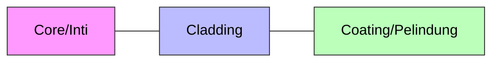

Selamat datang di **Layer 1 (Physical)**. Di sini tempatnya kuli kabel beraksi. Camkan ini baik-baik:
> *"Kalau kabel jelek atau crimpingan ampas, config router se-dewa apapun percuma. Latency tinggi, packet loss, dimarahin klien."*

## 🧵 Kabel UTP (Tembaga)

Kabel LAN standar sejuta umat. Di dalamnya ada 8 kabel kecil (4 pasang) yang dipilin.

### Straight vs Cross
*   **Straight:** Urutan warna ujung A dan B **SAMA**. Standar hari ini.
*   **Cross:** Urutan warna beda. Dulu buat hubungin device sejenis (Laptop ke Laptop), sekarang **JARANG DIPAKAI** karena alat jaman now sudah pintar (fitur *Auto-MDIX*).

### 🎨 Kode Warna (Hukum Wajib Hafal)

Jangan sampai tertukar antara standar A dan B. Indonesia mayoritas pakai **T568B**.

| Pin | T568B (Standar Kita) | Visual |
| :--- | :--- | :--- |
| 1 | **Putih Orange** | 

 |
| 2 | **Orange** | 

 |
| 3 | **Putih Hijau** | 

 |
| 4 | **Biru** | 

 |
| 5 | **Putih Biru** | 

 |
| 6 | **Hijau** | 

 |
| 7 | **Putih Coklat** | 

 |
| 8 | **Coklat** | 

 |

:::tip[Tips Crimping Anti Gagal]
Saat memasukkan kabel ke konektor RJ-45, pastikan **kulit kabel luar (jacket)** ikut masuk dan terjepit di dalam konektor.
*   **Kalau terjepit:** Kabel awet, ditarik gak copot.
*   **Kalau nggak:** Kabel gampang goyang, koneksi putus-nyambung (intermittent).
:::

---

## 💎 Fiber Optic (Kaca)

Sultan-nya media transmisi. Menggunakan cahaya untuk kirim data.
*   **Kecepatan:** Speed of light (cahaya).
*   **Jarak:** Bisa puluhan KM tanpa sinyal turun.
*   **Kelebihan:** Anti petir, anti gangguan sinyal radio (interferensi).

### Jenis Kabel FO (Wajib Tau Biar Gak Salah Beli)

| Jenis | Warna Kabel | Inti (Core) | Jarak Tempuh | Sinar |
| :--- | :--- | :--- | :--- | :--- |
| **Single Mode** | 🟡 **Kuning** | Kecil banget (9 mikron) | Jauh banget (Antar Kota/Gedung) | Laser |
| **Multi Mode** | 🟠 **Orange** / 💠 **Tosca** | Agak besar (50-62.5 mikron) | Pendek (Dalam Gedung Server) | LED |

### Anatomi Kabel FO

Bagian dalam sehelai kabel optik (Core) itu setipis rambut manusia.

1.  **Core:** Kaca tipis tempat cahaya lewat.
2.  **Cladding:** Pemantul cahaya agar tetap di dalam core (prinsip *Total Internal Reflection*).
3.  **Coating:** Plastik pelindung kaca biar gak gampang patah.

### 🌈 Kode Warna 12 Core (The Legend)

Di lapangan, satu kabel FO besar (tube) isinya bisa banyak core. Biar gak bingung, ada urutan warnanya.

**Mnemonic:** *"BOHCAP MeHiKuUPiTo"* (Hapalkan mantra ini!)

| No | Warna | Mnemonic | Visual |
| :-- | :-- | :-- | :-- |
| 1 | **Biru** | **B** | 

 |
| 2 | **Orange** | **O** | 

 |
| 3 | **Hijau** | **H** | 

 |
| 4 | **Coklat** | **C** | 

 |
| 5 | **Abu-abu** | **A** | 

 |
| 6 | **Putih** | **P** | 

 |
| 7 | **Merah** | **Me** | 

 |
| 8 | **Hitam** | **Hi** | 

 |
| 9 | **Kuning** | **Ku** | 

 |
| 10 | **Ungu** | **U** | 

 |
| 11 | **Pink** | **Pi** | 

 |
| 12 | **Tosca** | **To** | 

 |

:::note
Urutan 1-12 ini berulang. Kalau ada core ke-13, warnanya balik ke **Biru** tapi biasanya ada tanda garis hitam.
:::

### 🛠️ Alat Perang FO (Mahal!)
*   **Splicer:** Mesin las kaca untuk nyambung kabel putus. Harganya seharga motor.
*   **Cleaver:** Alat potong kaca presisi. Kalau motongnya miring, di-las (*splicing*) bakal gagal terus. *Jangan coba-coba potong pake gunting kuku!*
*   **Stripper:** Tang pengupas kulit kabel FO. Beda sama tang potong biasa, ini ada lubang ukurannya mikron.
*   **OPM (Optical Power Meter):** Buat ngecek "redaman" (kekuatan sinyal). Kalau minusnya gede, sinyal jelek.
*   **VFL (Visual Fault Locator):** Senter laser merah buat nyari kabel putus (tembus pandang).