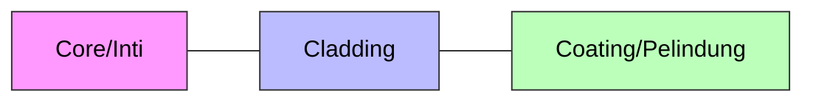

Selamat datang di **Layer 1 (Physical)**. Di sini tempatnya kuli kabel beraksi. Camkan ini baik-baik:
> *"Kalau kabel jelek atau crimpingan ampas, config router se-dewa apapun percuma. Latency tinggi, packet loss, dimarahin klien."*

## 🧵 Kabel UTP (Tembaga)

Kabel LAN standar sejuta umat. Di dalamnya ada 8 kabel kecil (4 pasang) yang dipilin.

### Straight vs Cross
*   **Straight:** Urutan warna ujung A dan B **SAMA**. Standar hari ini.
*   **Cross:** Urutan warna beda. Dulu buat hubungin device sejenis (Laptop ke Laptop), sekarang **JARANG DIPAKAI** karena alat jaman now sudah pintar (fitur *Auto-MDIX*).

### 🎨 Kode Warna (Hukum Wajib Hafal)

Jangan sampai tertukar antara standar A dan B. Indonesia mayoritas pakai **T568B**.

| Pin | T568A (Jarang) | **T568B (Standar Kita)** |
| :--- | :--- | :--- |
| 1 | ⚪🟢 Putih Hijau | **⚪🟠 Putih Orange** |
| 2 | 🟢 Hijau | **🟠 Orange** |
| 3 | ⚪🟠 Putih Orange | **⚪🟢 Putih Hijau** |
| 4 | 🔵 Biru | **🔵 Biru** |
| 5 | ⚪🔵 Putih Biru | **⚪🔵 Putih Biru** |
| 6 | 🟠 Orange | **🟢 Hijau** |
| 7 | ⚪🟤 Putih Coklat | **⚪🟤 Putih Coklat** |
| 8 | 🟤 Coklat | **🟤 Coklat** |

:::tip[Tips Crimping Anti Gagal]
Saat memasukkan kabel ke konektor RJ-45, pastikan **kulit kabel luar (jacket)** ikut masuk dan terjepit di dalam konektor.
*   **Kalau terjepit:** Kabel awet, ditarik gak copot.
*   **Kalau nggak:** Kabel gampang goyang, koneksi putus-nyambung (intermittent).
:::

---

## 💎 Fiber Optic (Kaca)

Sultan-nya media transmisi. Menggunakan cahaya untuk kirim data.
*   **Kecepatan:** Speed of light (cahaya).
*   **Jarak:** Bisa puluhan KM tanpa sinyal turun.
*   **Kelebihan:** Anti petir, anti gangguan sinyal radio (interferensi).

### Anatomi Kabel FO

Bagian dalam sehelai kabel optik (Core) itu setipis rambut manusia.

1.  **Core:** Kaca tipis tempat cahaya lewat.
2.  **Cladding:** Pemantul cahaya agar tetap di dalam core (prinsip *Total Internal Reflection*).
3.  **Coating:** Plastik pelindung kaca biar gak gampang patah.

### 🌈 Kode Warna 12 Core (The Legend)

Di lapangan, satu kabel FO besar (tube) isinya bisa banyak core. Biar gak bingung, ada urutan warnanya.

**Mnemonic:** *"BOHCAP MeHiKuUPiTo"* (Hapalkan mantra ini!)

| No | Warna | Mnemonic |
| :-- | :-- | :-- |
| 1 | 🔵 **Biru** | **B** |
| 2 | 🟠 **Orange** | **O** |
| 3 | 🟢 **Hijau** | **H** |
| 4 | 🟤 **Coklat** | **C** |
| 5 | ⚪ **Abu-abu** | **A** |
| 6 | ⚪ **Putih** | **P** |
| 7 | 🔴 **Merah** | **Me** |
| 8 | ⚫ **Hitam** | **Hi** |
| 9 | 🟡 **Kuning** | **Ku** |
| 10 | 🟣 **Ungu** (Violet) | **U** |
| 11 | 🌸 **Pink** (Merah Muda) | **Pi** |
| 12 | 💠 **Tosca** (Turquoise) | **To** |

:::note
Urutan 1-12 ini berulang. Kalau ada core ke-13, warnanya balik ke **Biru** tapi biasanya ada tanda garis hitam.
:::

### 🛠️ Alat Perang FO (Mahal!)
*   **Splicer:** Mesin las kaca untuk nyambung kabel putus. Harganya seharga motor.
*   **OPM (Optical Power Meter):** Buat ngecek "redaman" (kekuatan sinyal). Kalau minusnya gede, sinyal jelek.
*   **VFL (Visual Fault Locator):** Senter laser merah buat nyari kabel putus (tembus pandang).
